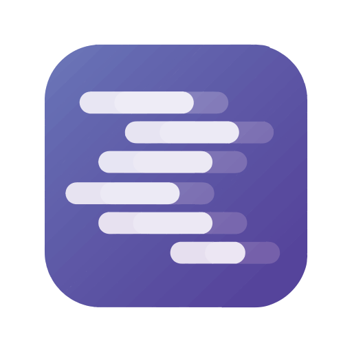

# "Eddy" LLM Workbench

**Local-first switchboard for six providers:** Groq • Mistral • OpenAI • Google • LM Studio • Anthropic
BYO keys • Zero telemetry • One-command run • Compare outputs side-by-side

<p align="center">
  
  
  
  
  
  
</p>

---

## Quickstart

Run the container (multi-arch image: `linux/amd64` and `arm64`):

```docker run -d --name llm-workbench --restart unless-stopped \
  -p 127.0.0.1:8080:8080 \
  -e NODE_ENV=production \
  -e PORT=5000 \
  -v "$HOME/.config/llm-workbench:/home/llm/.config/llm-workbench:rw" \
  visionforge4d/eddy-llm-workbench:latest

# Health (Nginx + API)
curl -fsS http://127.0.0.1:8080/nginx-healthz && echo "OK"
curl -fsS http://127.0.0.1:8080/health && echo
```

Then open: [http://localhost:8080](http://localhost:8080)

Click a tile to choose a provider. Run prompts, compare outputs, export sessions.

---

## Features

* **Switchboard UI**
  Six providers live with distinct tiles & icons (Groq, Mistral, OpenAI, Google, LM Studio, Anthropic).

* **Side-by-side compare**
  Run the same prompt across multiple providers and view outputs together with latency metrics.

* **Local session log**
  Every run is saved to JSONL in your config directory.

* **Export**
  One-click export of your session to JSONL or Markdown (with provider + model + latency).

* **Local-first**
  Binds to localhost, strict CORS, no telemetry, BYO keys.

---

## Config

Config file lives at:
`~/.config/llm-workbench/config.yml`
(default perms: 0600, dir 0700)

Example:

```yaml
keys:
  openai: ""          # sk-...
  groq: ""            # gsk_...
  anthropic: ""       # claude key
  google: ""          # Gemini key
  mistral: ""         # Mistral key
  lmstudio_base_url: "http://127.0.0.1:1234"

server:
  bind_host: "0.0.0.0"
  port: 8080

security:
  cors_origins: ["http://localhost:8080"]
  rate_limit_rpm: 60

ui:
  default_provider: "lmstudio"
```

* If a provider key is missing, its tile is greyed out until configured.
* LM Studio is used as the fallback provider.

---

## Privacy & Security

* **Zero telemetry.** Nothing leaves your machine except your API calls.
* **Keys stay local.** Stored in your config file only; never logged.
* **No secret logging.** Console output excludes prompts & keys.
* **Safe defaults.** Localhost bind, strict CORS, rate limiting.

---

## Roadmap

* [ ] Add Ollama provider
* [ ] Fedora COPR / RPM packaging (systemd service)
* [ ] Flatpak for Linux desktop
* [ ] Preset Compare pairs (Groq vs Anthropic, OpenAI vs Mistral)

---

## Contributing

Contributions welcome!

* See [CONTRIBUTING.md](CONTRIBUTING.md) for guidelines.
* Provider adapters are small modules—follow the `Provider` interface to add more.
* Please open issues for bugs, feature requests, or provider quirks.

---

## Demo


*A short demo of switching between providers and exporting a session.*

---

## License

MIT © \[VisionForge4d]

---

## Launch Links

* Show HN: *"Eddy" LLM Workbench — local-first switchboard for Groq, Mistral, OpenAI, Google, LM Studio, Anthropic*
* Reddit: r/selfhosted • r/LocalLLaMA • r/MachineLearning

Feedback, issues, and PRs very welcome.
